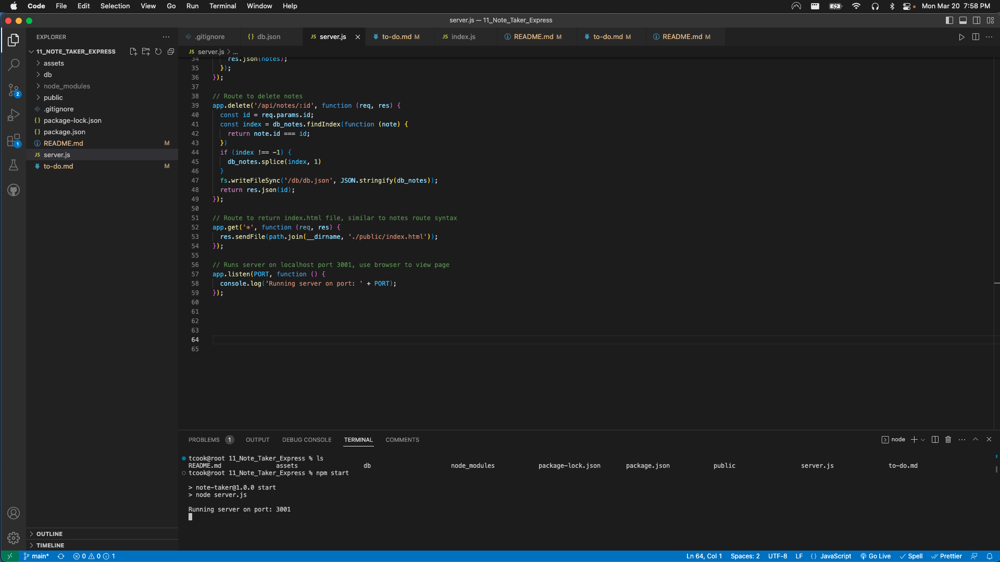
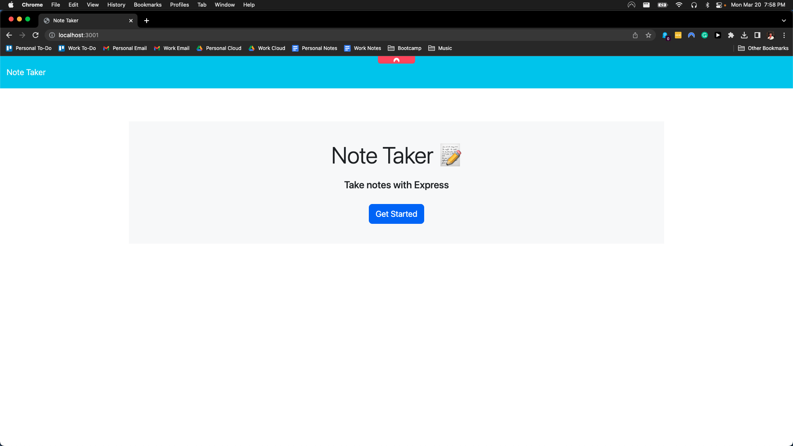
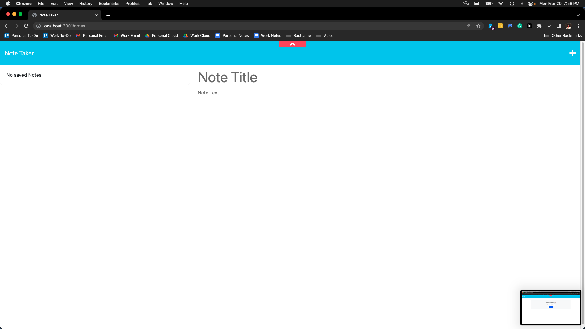
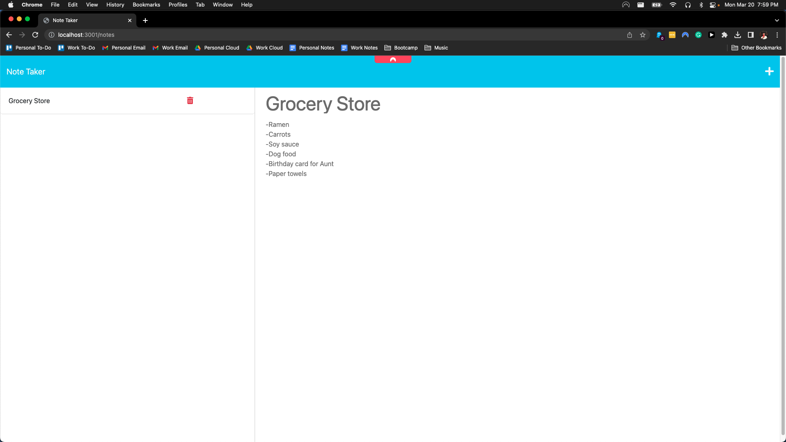

# Note Taker

Project Repo: [Github-repo](https://github.com/timothymichaelcook/11_Note_Taker_Express)
Deployed Project: [Deployed-application](https://note-taker-express-cook.herokuapp.com/)


## Description

The focus of this project was to create a web application with a home page and note taking page. The home page displays a button which take you to a notes page. Users can create notes with a title and information, save notes as well as delete notes.

## User Story

```
- AS A small business owner
- I WANT to be able to write and save notes
- SO THAT I can organize my thoughts and keep track of tasks I need to complete
```

## Installation

- Express NPM package (for running server)
- npm i
- npm start
- Browser to view the webpage (port 3001)

## Usage

Users needs to be in the root folder of the project and 'npm i' or 'npm install' to install necessary dependencies. Once installed, users will need to run 'npm start' to start the server on port 3001. 
Open a browser and navigate to localhost/3001, click the button on the homepage. This will take the user to the notes page. Click the + icon to create a new note, fill out the title and description fields. Once done, click the save button and which will save the note in the left column. To delete a note, click the trash icon next to the note in the left column.

## Credits

University of Richmond Coding Bootcamp

## License

MIT License

## Screenshots/Videos REDO






## Contact
Timothy Cook - timothy.michael.cook@gmail.com
